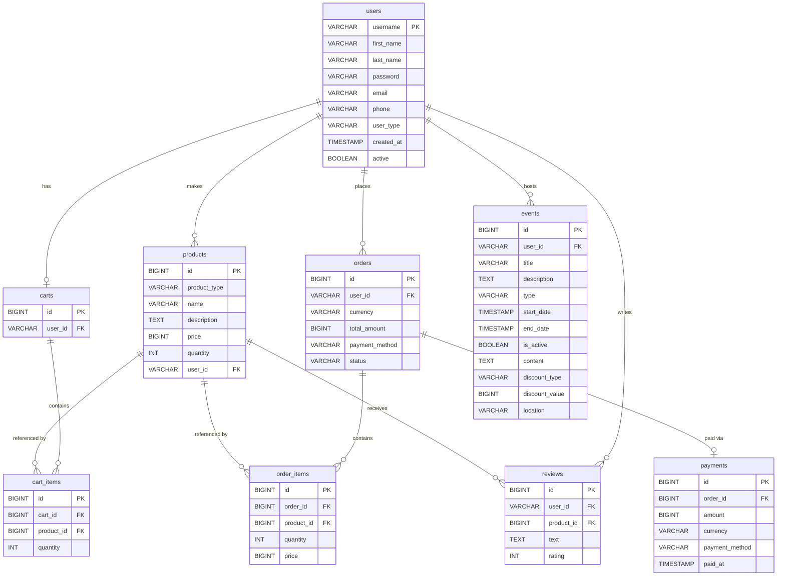

# Local-Marketplace-Web-Java

A web application for managing an online marketplace for handmade and artisanal products. Users can register, browse and list products, manage a shopping cart, place orders, leave reviews, and create community events (promotions, craft fairs, and storytelling features). A static HTML/CSS/JS frontend is served alongside the REST API.

***

## Tech Stack

| Layer          | Technology                                              |
| -------------- | ------------------------------------------------------- |
| Language       | Java 26                                                 |
| Framework      | Spring Boot 4.0.5                                       |
| Database       | PostgreSQL (schema: `market`)                           |
| Migrations     | Liquibase                                               |
| Security       | Spring Security + JWT (jjwt)                            |
| API Docs       | springdoc-openapi / Swagger UI                          |
| ORM            | Spring Data JPA / Hibernate                             |
| Validation     | Jakarta Bean Validation                                 |
| Frontend       | Static HTML/CSS/JS (`src/main/resources/static/`)       |

***

## Running Locally

1. Start a PostgreSQL instance and create a schema named `market`.
2. Configure connection credentials in `src/main/resources/application.yml` (defaults: `localhost:5432`, user `postgres`, password `123456789`).
3. Run with the `dev` profile — Liquibase applies all migrations automatically:
   ```
   ./mvnw spring-boot:run -Dspring-boot.run.profiles=dev
   ```
4. The server starts on **port 9090** (dev profile).
5. Swagger UI is available at: `http://localhost:9090/swagger-ui.html`

***

## Authentication

The API uses **stateless JWT authentication**.

- `POST /auth/register` — creates an account and returns the user profile.
- `POST /auth/login` — validates credentials and returns a signed JWT token.
- For all protected endpoints, include the token in the request header:
  ```
  Authorization: Bearer <token>
  ```
- Logout is client-side only — discard the token; the server keeps no session state.

***

## REST Resources

### Authentication

| Method | Endpoint               | Action                              |
| ------ |:----------------------:| :-----------------------------------|
| `POST` | /auth/register         | Register a new user                 |
| `POST` | /auth/login            | Login — returns a JWT token         |
| `POST` | /auth/logout           | Logout (client discards token)      |
| `POST` | /auth/forgot-password  | Request password reset (stub)       |

***

### Users

| Method   | Endpoint                    | Action                                      |
| -------- |:---------------------------:| :-------------------------------------------|
| `GET`    | /api/users                  | Get all users (paginated)                   |
| `GET`    | /api/users/{username}       | Get a user by username                      |
| `POST`   | /api/users                  | Create user                                 |
| `PUT`    | /api/users/{username}       | Update user (email, password, phone)        |
| `DELETE` | /api/users/{username}       | Delete user                                 |
| `GET`    | /api/users/{username}/is-admin | Check whether a user has admin role      |

***

### Products

| Method   | Endpoint                          | Action                                     |
| -------- |:---------------------------------:| :------------------------------------------|
| `GET`    | /api/products                     | List products (see filters below)          |
| `GET`    | /api/products/{id}                | Get product by ID                          |
| `POST`   | /api/products                     | Create a new product (authenticated)       |
| `PUT`    | /api/products/{id}                | Update a product (maker only)              |
| `DELETE` | /api/products/{id}                | Delete a product (maker only)              |
| `GET`    | /api/products/{id}/comments       | Get paginated reviews for a product        |
| `POST`   | /api/products/{id}/comments       | Submit a review for a product              |

#### Query Parameters for GET /api/products

| Parameter        | Type   | Description                           | Example                    |
|------------------|--------|---------------------------------------|----------------------------|
| `product_type`   | String | Filter by product type enum value     | product_type=JEWELRY       |
| `maker_username` | String | Filter by the maker's username        | maker_username=john_doe    |

***

### Reviews

| Method   | Endpoint             | Action                          |
| -------- |:--------------------:| :-------------------------------|
| `GET`    | /api/reviews/{id}    | Get a single review by ID       |
| `PUT`    | /api/reviews/{id}    | Update a review (author only)   |
| `DELETE` | /api/reviews/{id}    | Delete a review (author only)   |

***

### Cart

| Method   | Endpoint                           | Action                        |
| -------- |:----------------------------------:| :-----------------------------|
| `GET`    | /api/users/me/cart                 | Get current user's cart       |
| `POST`   | /api/users/me/cart/items           | Add item to cart              |
| `PUT`    | /api/users/me/cart/items/{itemId}  | Update item quantity          |
| `DELETE` | /api/users/me/cart/items/{itemId}  | Remove item from cart         |
| `DELETE` | /api/users/me/cart                 | Clear all items from cart     |

***

### Orders

| Method   | Endpoint                 | Action                                               |
| -------- |:------------------------:| :----------------------------------------------------|
| `POST`   | /api/orders              | Place order from cart (snapshots prices, clears cart)|
| `GET`    | /api/orders              | List orders (admin = all; user = own orders)         |
| `GET`    | /api/orders/{id}         | Get order by ID (owner or admin)                     |
| `PATCH`  | /api/orders/{id}/pay     | Pay for a PENDING_PAYMENT order (records payment)    |
| `PATCH`  | /api/orders/{id}/status  | Update order status (incl. CANCELLED)                |

***

### Events

| Method   | Endpoint           | Action                                           |
| -------- |:------------------:| :------------------------------------------------|
| `GET`    | /api/events        | List events (see filters below)                  |
| `GET`    | /api/events/{id}   | Get event by ID                                  |
| `POST`   | /api/events        | Create event (authenticated)                     |
| `PUT`    | /api/events/{id}   | Update event (owner only)                        |
| `DELETE` | /api/events/{id}   | Delete event (owner only)                        |

#### Query Parameters for GET /api/events

| Parameter | Type    | Description                                                              | Example                   |
|-----------|---------|--------------------------------------------------------------------------|---------------------------|
| `type`    | String  | Filter by event type enum value                                          | type=CRAFT_FAIRS          |
| `active`  | Boolean | Filter by active status                                                  | active=true               |

Event types: `CRAFT_FAIRS`, `PROMOTIONAL_CAMPAIGNS`, `STORYTELLING_FEATURES`.

***

## Database Diagram



***